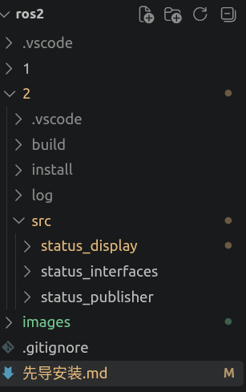

# ROS 2 Python 节点 开发与编译 完整文档

> 适用环境：Ubuntu + ROS 2 Humble（其他版本把 `humble` 换成你的版本即可）
> 适用语言：Python（`ament_python` 构建类型）

---

## 目录

- [一、总览：标准流程](#一总览标准流程)
- [二、详细步骤](#二详细步骤)
- [三、运行时操作](#三运行时操作另开终端)
- [四、启动时传参数](#四启动时传参数)
- [五、修改代码后的操作](#五修改代码后的操作)
- [六、常见错误排查](#六常见错误排查)
- [七、完整命令速查](#七完整命令速查复制即用)
- [八、日常开发流程](#八日常开发流程)
- [九、目录结构速览](#九目录结构速览)
- [十、核心要点总结](#十核心要点总结)
- [十一、参考命令对照表](#十一参考命令对照表)
- [十二、动手练习](#十二动手练习建议按顺序做一遍)

---

## 一、总览：标准流程

```
① 建工作空间        ~/ros2/
② 建功能包          ~/ros2/src/<包名>/
③ 写代码            ~/ros2/src/<包名>/<包名>/<节点名>.py
④ 配 setup.py       注册可执行命令（entry_points）
⑤ 编译              colcon build
⑥ source 环境       source install/setup.bash
⑦ 运行              ros2 run <包名> <可执行名>
```

**核心思想**：

> 代码放在"功能包"里，通过 `setup.py` 注册成"命令"，用 `ros2 run` 启动。

---

## 二、详细步骤

### 第 0 步：环境准备

```bash
# 确认 ROS 2 已安装并 source
source /opt/ros/humble/setup.bash
echo $ROS_DISTRO        # 应输出 humble

# 确认 colcon 已安装
colcon --version
# 如果没有，安装：
# sudo apt install python3-colcon-common-extensions
```

---

### 第 1 步：创建工作空间

```bash
mkdir -p ~/ros2/src
cd ~/ros2
```

**目录结构：**

```
~/ros2/
└── src/          ← 所有功能包放这里
```

**工作空间三要素**（编译后自动生成）：


| 目录       | 作用         |
| ---------- | ------------ |
| `src/`     | 源码         |
| `build/`   | 编译中间产物 |
| `install/` | 安装结果     |
| `log/`     | 编译日志     |

---

### 第 2 步：创建功能包

```bash
cd ~/ros2/src
ros2 pkg create --build-type ament_python <包名> --dependencies rclpy std_msgs --license Apache-2.0
```

**示例：**

```bash
ros2 pkg create --build-type ament_python demo_pkg --dependencies rclpy std_msgs --license Apache-2.0
```

**参数说明：**


| 参数                            | 含义                             |
| ------------------------------- | -------------------------------- |
| `--build-type ament_python`     | Python 包（C++ 用`ament_cmake`） |
| `<包名>`                        | 包的名字，如`demo_pkg`           |
| `--dependencies rclpy std_msgs` | 声明依赖                         |

**生成结构：**

```
~/ros2/src/demo_pkg/
├── demo_pkg/              ← Python 模块目录（代码放这里）
│   └── __init__.py
├── resource/
│   └── demo_pkg
├── test/
│   ├── test_copyright.py
│   ├── test_flake8.py
│   └── test_pep257.py
├── package.xml            ← 包信息（名字、依赖、维护者）
├── setup.py               ← ★ 关键：注册可执行命令
└── setup.cfg              ← 安装配置
```

> ⚠️ **注意两层同名目录**：
>
> - 外层 `demo_pkg/` = 包目录
> - 内层 `demo_pkg/` = Python 模块目录（代码放这里）

---

### 第 3 步：编写节点代码

**文件路径：**

```
~/ros2/src/demo_pkg/demo_pkg/<节点名>.py
```

**示例节点 `demo_node.py` 完整代码：**

```python
#!/usr/bin/env python3
# -*- coding: utf-8 -*-

import rclpy
from rclpy.node import Node
from rclpy.executors import ExternalShutdownException
from std_msgs.msg import String


class DemoNode(Node):
    def __init__(self):
        super().__init__('demo_node')

        # 1. 声明参数
        self.declare_parameter('publish_period', 1.0)
        self.declare_parameter('message_prefix', 'hello')

        self.period = self.get_parameter('publish_period').value
        self.prefix = self.get_parameter('message_prefix').value
        self.count = 0

        # 2. 发布者
        self.pub = self.create_publisher(String, 'chatter', 10)

        # 3. 订阅者
        self.sub = self.create_subscription(
            String, 'chatter', self.on_chatter, 10)
        self.cmd_sub = self.create_subscription(
            String, 'cmd', self.on_cmd, 10)

        # 4. 参数变更回调
        self.add_on_set_parameters_callback(self.on_param_change)

        # 5. 定时器
        self.timer = self.create_timer(self.period, self.on_timer)

        self.get_logger().info(
            f'demo_node 已启动: period={self.period}s, prefix={self.prefix}')

    def on_timer(self):
        self.count += 1
        msg = String()
        msg.data = f'{self.prefix} #{self.count}'
        self.pub.publish(msg)
        self.get_logger().info(f'发布: {msg.data}')

    def on_chatter(self, msg):
        self.get_logger().info(f'收到 chatter: {msg.data}')

    def on_cmd(self, msg):
        self.get_logger().warn(f'收到指令: {msg.data}')

    def on_param_change(self, params):
        for p in params:
            if p.name == 'publish_period':
                self.period = float(p.value)
                self.destroy_timer(self.timer)
                self.timer = self.create_timer(self.period, self.on_timer)
                self.get_logger().info(f'定时器周期已改为 {self.period}s')
            elif p.name == 'message_prefix':
                self.prefix = str(p.value)
        return rclpy.node.SetParametersResult(successful=True)


def main(args=None):
    rclpy.init(args=args)
    node = DemoNode()
    try:
        rclpy.spin(node)
    except (KeyboardInterrupt, ExternalShutdownException):
        pass
    finally:
        node.destroy_node()
        if rclpy.ok():
            rclpy.shutdown()


if __name__ == '__main__':
    main()
```

**关键点：**

- 必须继承 `Node`
- 必须有 `main(args=None)` 函数
- 必须有 `if __name__ == '__main__': main()`

---

### 第 4 步：配置 setup.py（★ 最关键）

打开 `~/ros2/src/demo_pkg/setup.py`，修改 `entry_points`：

```python
entry_points={
    'console_scripts': [
        'demo_node = demo_pkg.demo_node:main',
        #   ↑            ↑        ↑      ↑
        # 命令名      包名    模块名  函数名
    ],
},
```

**含义：**

> 定义一条命令 `demo_node`，执行它 = 运行 `demo_pkg/demo_node.py` 里的 `main()` 函数。

**完整 `setup.py` 参考（可直接覆盖）：**

```python
from setuptools import setup

package_name = 'demo_pkg'

setup(
    name=package_name,
    version='0.0.0',
    packages=[package_name],
    data_files=[
        ('share/ament_index/resource_index/packages',
            ['resource/' + package_name]),
        ('share/' + package_name, ['package.xml']),
    ],
    install_requires=['setuptools'],
    zip_safe=True,
    maintainer='your_name',
    maintainer_email='your_email@example.com',
    description='TODO: Package description',
    license='TODO: License declaration',
    tests_require=['pytest'],
    entry_points={
        'console_scripts': [
            'demo_node = demo_pkg.demo_node:main',
        ],
    },
)
```

**常见错误：**


| 错误写法                  | 问题                      |
| ------------------------- | ------------------------- |
| `entry_point`             | 少`s`                     |
| `demo_pkg.demo_node.main` | 应该用冒号`:`，不是点 `.` |
| 缩进错位                  | Python 对缩进敏感         |
| 少了逗号                  | 列表元素间必须有逗号      |

---

### 第 5 步：编译

```bash
cd ~/ros2
colcon build --packages-select demo_pkg
```

**成功输出：**

```
Starting >>> demo_pkg
Finished <<< demo_pkg [0.78s]
Summary: 1 package finished [1.06s]
```

**常用 colcon 命令：**


| 命令                                       | 作用                                         |
| ------------------------------------------ | -------------------------------------------- |
| `colcon build --packages-select demo_pkg`  | 只编译指定包                                 |
| `colcon build`                             | 编译所有包                                   |
| `colcon build --symlink-install`           | 符号链接方式（改 Python 不用重编，**推荐**） |
| `rm -rf build install log && colcon build` | 清缓存后完全重编                             |

> ★ **推荐用符号链接方式编译**：
>
> ```bash
> colcon build --symlink-install --packages-select demo_pkg
> ```
>
> 这样改 Python 代码后**不用重新 build**，直接 `ros2 run` 就能生效。

---

### 第 6 步：source 环境

```bash
source ~/ros2/install/setup.bash
```

> **每次新开终端都必须 source！**

**验证 source 成功：**

```bash
ros2 pkg list | grep demo_pkg
# 输出：demo_pkg
```

**一劳永逸（写进 `~/.bashrc`）：**

```bash
echo "source /opt/ros/humble/setup.bash" >> ~/.bashrc
echo "source ~/ros2/install/setup.bash" >> ~/.bashrc
source ~/.bashrc
```

---

### 第 7 步：运行节点

```bash
ros2 run demo_pkg demo_node
```

**期望输出：**

```
[INFO] [时间戳] [demo_node]: demo_node 已启动: period=1.0s, prefix=hello
[INFO] [时间戳] [demo_node]: 发布: hello #1
[INFO] [时间戳] [demo_node]: 收到 chatter: hello #1
[INFO] [时间戳] [demo_node]: 发布: hello #2
[INFO] [时间戳] [demo_node]: 收到 chatter: hello #2
...
```

**停止**：`Ctrl+C`

---

## 三、运行时操作（另开终端）

```bash
# 先 source
source /opt/ros/humble/setup.bash
source ~/ros2/install/setup.bash

# 查看节点
ros2 node list

# 查看话题
ros2 topic list

# 查看参数
ros2 param list
ros2 param get /demo_node publish_period

# 查看节点详情
ros2 node info /demo_node

# 给 cmd 话题发消息
ros2 topic pub /cmd std_msgs/msg/String "data: 'stop'"

# 运行时修改参数
ros2 param set /demo_node publish_period 2.0
ros2 param set /demo_node message_prefix ping
```

---

## 四、启动时传参数

```bash
ros2 run demo_pkg demo_node --ros-args -p publish_period:=0.5 -p message_prefix:=hi
```

**语法**：`--ros-args -p 参数名:=值`

---

## 五、修改代码后的操作

**如果用了 `--symlink-install`：**

> 直接改代码 → 重新 `ros2 run` 即可（无需重编）。

**如果没用 `--symlink-install`：**

```bash
cd ~/ros2
colcon build --packages-select demo_pkg
source install/setup.bash
ros2 run demo_pkg demo_node
```

---

## 六、常见错误排查


| 错误信息                                       | 原因                                   | 解决                                                |
| ---------------------------------------------- | -------------------------------------- | --------------------------------------------------- |
| `ModuleNotFoundError: No module named 'rclpy'` | 没 source ROS 2                        | `source /opt/ros/humble/setup.bash`                 |
| `Package 'demo_pkg' not found`                 | 没 source 工作空间                     | `source ~/ros2/install/setup.bash`                  |
| `No executable found`                          | setup.py 的 entry_points 没配 / 没重编 | 检查 setup.py，`rm -rf build install log` 后重编    |
| `No module named 'demo_pkg.demo_node'`         | 文件位置错                             | 确认路径是`demo_pkg/demo_pkg/demo_node.py`          |
| 改了代码没生效                                 | 没重编                                 | `colcon build` 或改用 `--symlink-install`           |
| `colcon: command not found`                    | 没装 colcon                            | `sudo apt install python3-colcon-common-extensions` |
| `BrokenPipeError`（`ros2 pkg list              | head`）                                | `head` 提前关闭管道                                 |

---

## 七、完整命令速查（复制即用）

```bash
# ============ 一次性完整流程 ============

# ① 建工作空间
mkdir -p ~/ros2/src
cd ~/ros2/src

# ② 建包
ros2 pkg create --build-type ament_python demo_pkg --dependencies rclpy std_msgs

# ③ 写代码到 demo_pkg/demo_pkg/demo_node.py
code demo_pkg/demo_pkg/demo_node.py

# ④ 改 setup.py 的 entry_points
code demo_pkg/setup.py
# 加：'demo_node = demo_pkg.demo_node:main'

# ⑤ 编译（推荐 --symlink-install）
cd ~/ros2
colcon build --symlink-install --packages-select demo_pkg

# ⑥ source
source install/setup.bash

# ⑦ 运行
ros2 run demo_pkg demo_node
```

---

## 八、日常开发流程

```
改代码 → (如果是 symlink 则跳过) colcon build → source → ros2 run
```

**建议第一次就用 `--symlink-install` 编译：**

```bash
colcon build --symlink-install --packages-select demo_pkg
```

以后改 Python 代码**不用重新 build**，直接 `ros2 run` 就生效，非常方便。

---

## 九、目录结构速览

```
~/ros2/                              ← 工作空间
├── src/                             ← 源码
│   └── demo_pkg/                    ← 包目录
│       ├── demo_pkg/                ← Python 模块目录
│       │   ├── __init__.py
│       │   └── demo_node.py         ← ★ 你的节点代码
│       ├── package.xml              ← 包信息
│       ├── setup.py                 ← ★ 注册可执行命令
│       └── setup.cfg
├── build/                           ← 编译中间产物（自动生成）
├── install/                         ← 安装结果（自动生成）
│   └── demo_pkg/
│       └── lib/
│           └── demo_pkg/
│               └── demo_node        ← 生成的可执行文件
└── log/                             ← 编译日志（自动生成）
```

---

## 十、核心要点总结

1. **代码位置**：`src/<包名>/<包名>/<节点名>.py`（两层同名目录）
2. **必须配 setup.py**：`entry_points` 里的 `console_scripts`
3. **每次新终端都要 source**：`source ~/ros2/install/setup.bash`
4. **推荐用 `--symlink-install`**：改代码不用重编
5. **启动用 `ros2 run`**：不是 `python3 xxx.py`
6. **传参数用 `--ros-args -p 名:=值`**

---

## 十一、参考命令对照表


| 场景             | 命令                                                                           |
| ---------------- | ------------------------------------------------------------------------------ |
| 建包             | `ros2 pkg create --build-type ament_python <名> --dependencies rclpy std_msgs` |
| 编译单包         | `colcon build --packages-select <名>`                                          |
| 编译（符号链接） | `colcon build --symlink-install --packages-select <名>`                        |
| source           | `source ~/ros2/install/setup.bash`                                             |
| 运行             | `ros2 run <包名> <可执行名>`                                                   |
| 传参数           | `ros2 run <包名> <可执行名> --ros-args -p 名:=值`                              |
| 查看节点         | `ros2 node list`                                                               |
| 查看话题         | `ros2 topic list`                                                              |
| 查看参数         | `ros2 param list`                                                              |
| 改参数           | `ros2 param set /节点名 参数名 值`                                             |
| 发消息           | `ros2 topic pub /话题名 消息类型 "data: '内容'"`                               |

---

## 十二、动手练习（建议按顺序做一遍）

### 练习 1：跑通现有节点

- 建包 `demo_pkg`
- 写入 `demo_node.py`
- 配 `setup.py`
- `colcon build --symlink-install --packages-select demo_pkg`
- `source install/setup.bash`
- `ros2 run demo_pkg demo_node`
- 看到 `hello #1 #2 #3` 就说明成功

### 练习 2：另开终端操控

```bash
ros2 node list
ros2 topic list
ros2 param list
ros2 topic pub /cmd std_msgs/msg/String "data: 'stop'"
ros2 param set /demo_node publish_period 2.0
```

观察节点终端日志变化。

### 练习 3：启动时传参数

```bash
# Ctrl+C 停掉节点
ros2 run demo_pkg demo_node --ros-args -p publish_period:=0.5 -p message_prefix:=hi
```

观察输出变为每 0.5 秒一次、前缀为 `hi`。

### 练习 4：改代码

- 打开 `demo_node.py`，改点东西（比如打印内容）
- 如果是 `--symlink-install`，直接 `ros2 run` 就生效
- 如果不是，需要重新 `colcon build`

---

## 提示

- 想加 **launch 文件、YAML 参数文件、自定义消息** 等进阶内容，可继续扩展本文档
- **每次新开终端别忘了 source**
- 遇到报错，优先检查：**包名是否一致、文件路径是否两层、setup.py 是否配好**

---

**文档结束**

补充：

打开设置（`Ctrl + ,`），搜索 `cmake.configureOnOpen`，**取消勾选**。这样打开 VS Code 时它就不会再自动跑 CMake 了。

tmd,编译要在总包下





当你运行 `colcon build` 时，它的工作流程是这样的：

1. 它先扫描你的工作空间 `~/ros2/2/src/`，发现里面有一个包叫 `status_display`（由包里面的 `package.xml` 和 `CMakeLists.txt` 的 `project()` 决定）。
2. 它为这个包单独创建一个安装根目录：`install/` **加上** 包名，也就是 `install/status_display/`。
3. 然后，它才去调用 CMake 执行你写的那句安装指令。CMake 只知道要把 `hello_qt` 放到 `lib/${PROJECT_NAME}/` 下面。但放到**哪个大文件夹**里呢？是 `colcon` 告诉 CMake 的：“你在这个包的所有路径前面，都加上 `install/status_display/` 这个前缀。”
